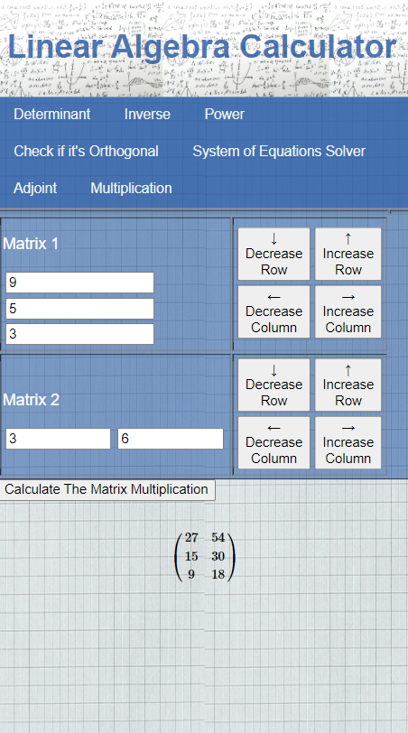

# Linear Algebra Calculator

Calculator for linear algebra calculations created for the web. Javascript has been used to calculate the operations. The mathjax library has been used to write the results.

Link: https://andresrodriguez55.github.io/LinearAlgebraCalculator/

## Screenshots

 |
|:---:|
